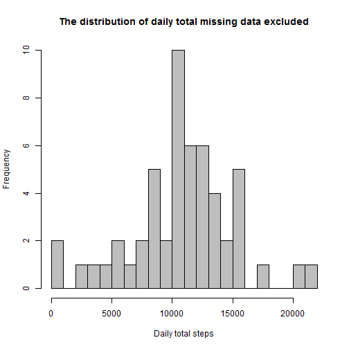
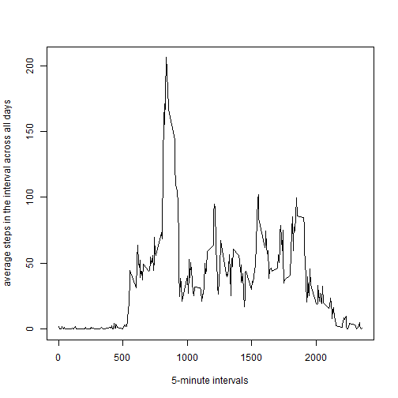
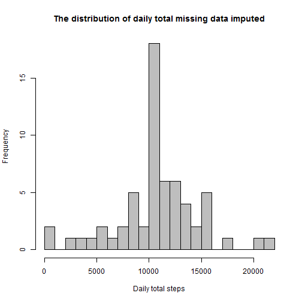
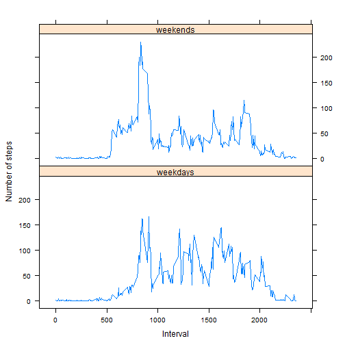

# R Markdown

This is an R Markdown document. Markdown is a simple formatting syntax for authoring HTML, PDF, and MS Word documents. For more details on using R Markdown see <http://rmarkdown.rstudio.com>.

When you click the **Knit** button a document will be generated that includes both content as well as the output of any embedded R code chunks within the document. You can embed an R code chunk like this:

**More infomation about this assignment/project including data,instructions etc. can be found in file README**

# Following is the analysis report

install.packages
install.packages("sqldf")
install.packages("lattice")
install.packages("timeDate")

**Loading and preprocessing the data**


```r
library(sqldf)
setwd("C:\\Users\\Yilu\\Desktop\\data")
fileUrl <- "https://d396qusza40orc.cloudfront.net/repdata%2Fdata%2Factivity.zip"
download.file(fileUrl,destfile="repdata-data-activity.zip") #download file
unzip(zipfile="repdata-data-activity.zip",exdir=".") #unzip  file 
data<-read.csv("activity.csv",header=T)
data$date <- as.Date(data$date,"%Y-%m-%d") #format date
```
For this part of the assignment, you can ignore the missing values in the dataset.

**What is mean total number of steps taken per day?**


```r
sum_by_date<-sqldf("select date, sum(steps) from data where steps is not null group by date")
```
Make a histogram of the total number of steps taken each day

```r
hist(x=sum_by_date[,2],col="grey",breaks=20,xlab="Daily total steps",ylab="Frequency",
main="The distribution of daily total missing data excluded")
```




Calculate and report the mean and median of the total number of steps taken per day

```r
mean(sum_by_date[,2])
```

```
## [1] 10766.19
```

```r
median(sum_by_date[,2])
```

```
## [1] 10765
```
**What is the average daily activity pattern?**

Make a time series plot (i.e. type = "l") of the 5-minute interval (x-axis) and the average number of steps taken, averaged across all days (y-axis)

```r
avg_by_interval<-sqldf("select interval, avg(steps) from data where steps is not null group by interval")
plot(avg_by_interval[,1],avg_by_interval[,2],type="l",xlab="5-minute intervals",ylab="average steps in the interval across all days")
```




**Which 5-minute interval, on average across all the days in the dataset, contains the maximum number of steps?**


```r
avg_by_interval[avg_by_interval[,2]==max(avg_by_interval[,2]),1]
```

```
## [1] 835
```
Imputing missing values

Calculate and report the total number of missing values in the dataset (i.e. the total number of rows with Na)

```r
sum(is.na(data$steps))
```

```
## [1] 2304
```
Devise a strategy for filling in all of the missing values in the dataset. The strategy does not need to be sophisticated. For example the mean for that 5-minute interval, etc.
Create a new dataset that is equal to the original dataset but with the missing data filled in

```r
data_rmna<-merge(data,avg_by_interval)
for (i in 1: dim(data_rmna)[1])
{
if (is.na(data_rmna[i,2])){data_rmna[i,2]=data_rmna[i,4]}
}
```
Make a histogram of the total number of steps taken each day and Calculate and report the mean and median total number of steps taken per day. 

**Do these values differ from the estimates from the first part of the assignment? What is the impact of imputing missing data on the estimates of the total daily number of steps?**


```r
sum_by_date_rmna<-sqldf("select date, sum(steps) from data_rmna group by date")
hist(x=sum_by_date_rmna[,2],col="grey",breaks=20,xlab="Daily total steps",ylab="Frequency",
main="The distribution of daily total missing data imputed")
```



```r
mean(sum_by_date_rmna[,2])
```

```
## [1] 10766.19
```

```r
median(sum_by_date_rmna[,2])
```

```
## [1] 10766.19
```


**Summary**

the mean doesn't change, but the median has a  change, this is becasue we replace our missing vlues with the means.

**Are there differences in activity patterns between weekdays and weekends?**

Create a new factor variable in the dataset with two levels – “weekday” and “weekend” indicating whether a given date is a weekday or weekend day.

```r
library(timeDate)
data_rmna_new<-cbind(data_rmna,isWeekday(data_rmna$date))
colnames(data_rmna_new)<-c(names(data_rmna),"isWeekday")
data_rmna_new$isWeekday <-ifelse(data_rmna_new$isWeekday==0,'weekdays','weekends')
data_rmna_new$isWeekday=as.factor(data_rmna_new$isWeekday)
```
Make a panel plot containing a time series plot (i.e. type = "l") of the 5-minute interval (x-axis) and the average number of steps taken, averaged across all weekday days or weekend days (y-axis). See the README file in the GitHub repository to see an example of what this plot should look like using simulated data.


```r
library(lattice)
avg_by_wk<-sqldf("select isWeekday, interval, avg(steps) from data_rmna_new group by isWeekday,interval")
colnames(avg_by_wk)<-c("isWeekday","interval","avg_steps")
xyplot(avg_steps~ interval | factor( isWeekday ),
       layout = c(1, 2),
       xlab="Interval",
       ylab="Number of steps",
       type="l",
       lty=1,
 data=avg_by_wk)
```



**Summary**

1).the weekends have higher activity levels than the weekdays.
2).the weekdays activities arise earlier than weekend's
3).the weekends activities have a spike around 800 interval,but weekdays activities dont have an obvilously spike.

